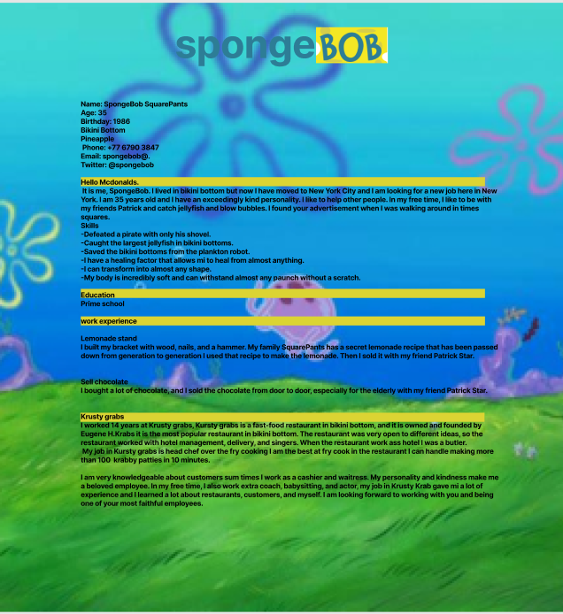

# Titel

Nizar Dawood 2021/11/18.

## Inledning

Här beskriver du kortfattat arbetets syfte/mål, arbetssätt, genomförande.
jag har gjort en hemsida ut av min Cv syftet med arbetet är att lära oss och jobba med html/css. Vi började med att skissa hur hemsidan skulle se ut på papper och sen till figma slutligen kod på visualstudio 

## Bakgrund

Redovisa arbetets olika delar. Så att läsaren förstår vad du gjort och hur.

Använd gärna bilder för att illustrera.

För att lägga till bilder i markdown. Bilderna kan du ladda upp med Git som vanligt, länka dem med url eller filnamnet.

jag började med att skissa  hur hemsidan skulle se ut på papper sen gick jag över till figma och förde över det jag gjorde på papper till figma och förbetrade lite. sen började jag koda 
```

Format: 
```

Format: 

## Positiva erfarenheter

Här beskriver du vad som har gått bra i ditt projekt och analyserar varför. Hur ska du upprepa framgångarna.

## Negativa erfarenheter

Här beskriver du det som du anser har gått mindre bra med ditt projekt och analyserar hur du kan undvika detta i framtida projekt.

## Sammanfattning

Här redovisar du dina slutsatser, erfarenheter och lärdomar. Reflektera över din produkt och dess/dina utvecklingsmöjligheter.
Vad kan vidareutvecklas och finns det utrymme att bygga vidare på projektet.
